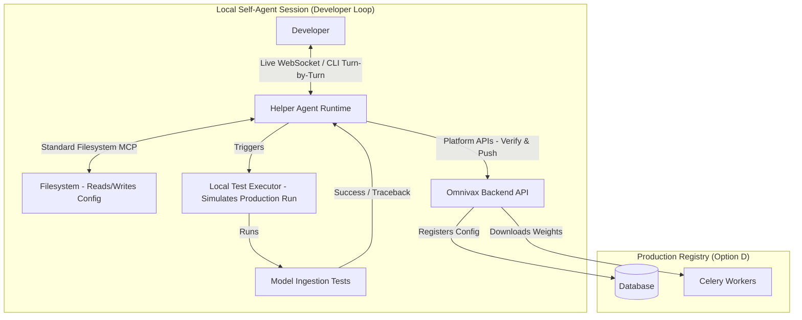

# Implementation Plan: Declarative Model Ingestion & Interactive Self-Agent Runtime

This plan outlines the design and implementation details for integrating model management and ingestion using a hybrid **Declarative Config (Option D)** and **Interactive Self-Agent Runtime (Option C)**.

---

## Developer Self-Agent System Diagram (Option C)

Below is the execution model for the persistent local developer agent loop:



---

## Technical Design & Execution Flow

### 1. Ingestion Config Schema (`config.json`)
Every registered model must contain a declarative config matching this format:
```json
{
  "model_id": "efficientnet_b0_v1", 
  "name": "EfficientNet B0 PlantVillage Classifier",
  "framework": "pytorch | tensorflow | sklearn | onnx | custom",
  "model_format": "safetensors | savedmodel | onnx | pickle | keras_h5",
  "model_source": {
    "hub": "huggingface | kaggle",
    "repo_id": "username/repo-slug",
    "filename": "model.safetensors"
  },
  "input_schema": {
    "modality": "image | audio | text | tabular",
    "parameters": {
      "image": {
        "dimensions": [224, 224, 3],
        "normalization": "imagenet | rescale_only | none"
      },
      "audio": {
        "sample_rate": 16000,
        "channels": 1,
        "format": "wav"
      },
      "text": {
        "max_length": 512
      }
    }
  },
  "output_schema": {
    "task_type": "classification | regression | object_detection | text_generation",
    "parameters": {
      "classification": {
        "class_names": ["healthy", "rust", "mildew"]
      },
      "object_detection": {
        "class_names": ["spot", "canker"],
        "confidence_threshold": 0.5
      }
    }
  }
}
```

*   **Model ID Generation**: The developer only provides the model name (e.g. `EfficientNet B0`). The system automatically generates a unique slugified `model_id` (e.g., `efficientnet_b0_v1`).
*   **Separation of Framework and Format**: Decouples the framework from the file serialization format. This allows standard framework engines to parse whatever serialization format is chosen.
*   **Decoupled Input Preprocessing**: Replaced granular step pipelines with high-level presets (e.g. `"normalization": "imagenet"`) to simplify developer definitions while maintaining clarity.
*   **Extensible Task-Based Output Schema**: Explicitly defines the output task type (`task_type`). Note that regression tasks or text-generation tasks do not enforce arbitrary fields like labels or units; they output raw numeric/text results directly based on task requirements.

---

## Architectural Impact & Code Adaptations

### 1. Database Level
*   **`models` Table Integration**: The incoming `config.json` properties map directly to SQLAlchemy `Model` fields:
    *   `framework` and `name` map to their respective columns.
    *   `input_schema` maps to the `input_spec` JSON string column.
    *   `output_schema.parameters.classification.class_names` maps to the `output_classes` JSON string column.
    *   The complete raw config JSON maps to the `metadata_json` catch-all column.
*   *No database migration is required since these fields are already present on the SQLAlchemy class.*

### 2. UI Wizard & CLI Level
*   **CLI**: The `omnivax models register --config path/to/config.json` command accepts this structured JSON config, validates it via Pydantic on the client side, and registers it.
*   **UI Dashboard**: The drag-and-drop workflow is upgraded to a wizard that helps developers populate this schema dynamically and previews the compiled JSON before uploading.

### 3. Backend Task / Execution Level
*   The Celery task reads the `model_source` block to download weights.
*   During inference, the unified preprocessor performs standard normalization based on the configuration preset, forwards the input to the framework runtime (ONNX, PyTorch, or TensorFlow/Keras), and maps the outputs depending on the `task_type`.

---

## The Interactive Self-Agent Runtime (Option C)

### 1. Agent Runtime Architecture
*   **Persistent Server**: A local Python process (FastAPI / Server WebSocket) that stays alive during the developer session.
*   **Interactive Interface**: Developers can interact with it via a CLI chat loop or a spin-up Web UI (similar to the MCP Inspector UI).
*   **Standard Filesystem MCP**: Used to read/write config files and explore the repository structure. No Git integration is needed.
*   **Platform API Integration**: The agent makes client calls directly to the Omnivax Backend APIs (`verify`, `register/push`) to run server-side checks and upload finalized configurations.

### 2. Future Extensibility: RAG Knowledge Base
*   The agent architecture is designed to support a future **RAG (Retrieval-Augmented Generation) MCP Tool**. This tool will index platform guidelines, configuration examples, and model error logs, allowing the agent to retrieve relevant solutions and suggest fixes to the developer when validation errors occur. *This will be integrated in a subsequent phase.*

---

## Verification & Testing Plan

### 1. Model Parsing & Preprocessing Tests
Unit tests in `tests/` will verify:
*   Correct scaling and normalization of synthetic image matrices using different configurations.
*   Model ID generator logic (validating unique slug production).

### 2. Persistent Session & Tool Execution Tests
*   Verify that the agent server processes consecutive WebSocket messages correctly and maintains conversational state across tool executions.
