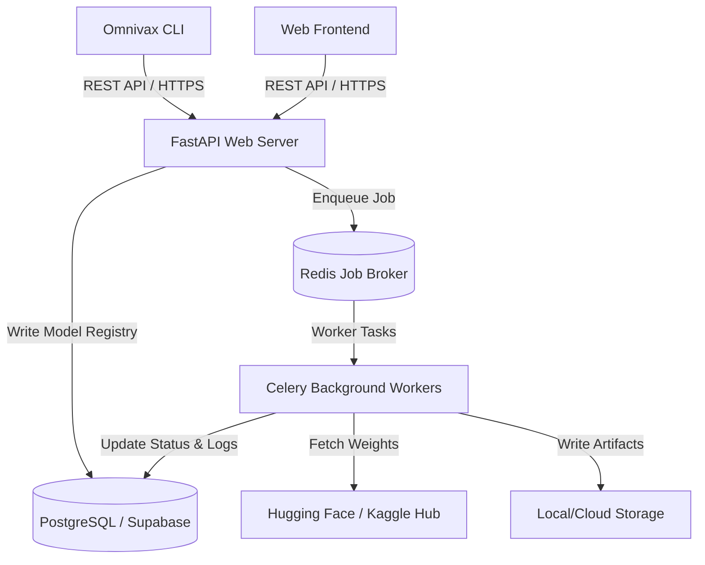

# Omnivax Platform Architecture

Omnivax is built as a high-performance Model-as-a-Service (MaaS) platform designed for plant disease diagnostics. The system follows a modular domain-driven layout with an asynchronous distributed queue execution engine.

---

## 🛠️ System Overview

---

## 📂 Domain Directory Layout

The backend directory is structured into domain areas to separate concerns and ensure maintainability:
*   `app/core/`: Application initialization, global settings (`settings.py`), and Celery configuration (`celery_app.py`).
*   `app/db/`: Database ORM models (`models.py`) and schema declarations.
*   `app/domains/auth/`: Credentials validation, Supabase identity matching, and long-lived API key hashing logic.
*   `app/domains/models/`: Model catalog management, uploads, directory scanning, and Celery background task handlers (`tasks.py`).
*   `app/domains/inference/`: Model inference lifecycle, including caching, framework adapters, and prediction services.
*   `app/infrastructure/`: Shared services such as caching utilities, rate limiting, and filesystem storage manager.

---

## ⚡ Asynchronous Model Hub Deployment Pipeline

To prevent API timeouts when pulling large deep learning weights, model registrations from remote hubs are processed asynchronously:
1.  **Job Dispatch**: The user issues a batch request via the CLI or UI. The FastAPI app validates the schema and stores a pending model record in the catalog.
2.  **Queue Enqueuing**: A Celery task (`deploy_model_from_hub`) is pushed to a Redis broker.
3.  **Worker Processing**: The Celery worker picks up the task and executes:
    *   Downloads the model artifacts/snapshots from Hugging Face or Kaggle.
    *   Resolves target directory paths and locates weights.
    *   Probes for a `config.json` file and parses model metadata (such as output classes).
    *   Runs automated validation/smoke tests using the Inference Adapter.
    *   Updates the DB status to `active` or `failed` and records verification logs.
