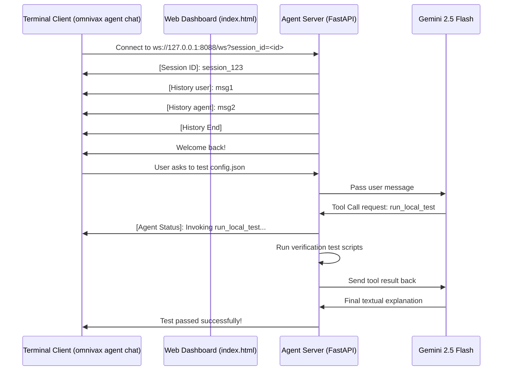

# Interactive Developer Agent Guide

The Omnivax Developer Helper Agent is an offline workspace assistant that sits alongside the developer in their terminal and browser, executing filesystem scanning, drafting model configurations, running local smoke tests, and registering components to the main platform.

---

## 🛠️ Architecture Overview

The system is composed of three interconnected parts:
1.  **FastAPI Agent Server (`agent/server.py`)**: Runs locally on port `8088`. Exposes endpoints, serves a standalone HTML dashboard, and manages WebSocket channels connecting to the Gemini 2.5 Flash model.
2.  **WebSocket Client (`agent/client.py`)**: Runs inside the terminal (`omnivax agent chat`), handling message exchanges and formatting tool invocation updates.
3.  **Local History Storage (`agent/history/`)**: Persists workspace conversations as human-readable JSON files.



---

## 🔌 WebSocket Communication Protocol

Communication is sent as plain text strings over WebSockets. Special commands are prefixed to orchestrate state updates:

| Prefix | Sender | Description |
| :--- | :--- | :--- |
| `[Session ID]: <id>` | Server | Broadcasts the active session ID to the client for saving and tracking. |
| `[History user]: <text>` | Server | Plays back a past user message on session restoration. |
| `[History agent]: <text>`| Server | Plays back a past agent response or status message on session restoration. |
| `[History system]: <text>`| Server | Plays back past tool executions outputs. |
| `[History End]` | Server | Signals that history playback has concluded. |
| `[Agent Status]: <text>` | Server | Notifies the client that the agent is running a background tool. |

---

## 📁 Local Session Storage Schema

Conversations are automatically logged in `agent/history/<session_id>.json`. The JSON logs conform to the following schema:

```json
{
  "session_id": "session_20260717_152340",
  "title": "Configure ResNet Model",
  "created_at": "2026-07-17T15:23:40.123456Z",
  "updated_at": "2026-07-17T15:25:10.789012Z",
  "status": "active",
  "messages": [
    {
      "sender": "agent",
      "text": "Hello! I am your offline workspace assistant..."
    },
    {
      "sender": "user",
      "text": "Scan my directory"
    },
    {
      "sender": "agent",
      "text": "[Agent Status]: Invoking tool 'list_directory'..."
    },
    {
      "sender": "system",
      "text": "Tool 'list_directory' returned: ['backend', 'frontend']"
    }
  ]
}
```

---

## 🎨 Standalone Glassmorphic Dashboard

The agent server serves its own dedicated frontend at `http://localhost:8088/`. 
*   **Chat Sidebar**: Pulls the list of saved logs from `GET /sessions` and allows developers to switch between past sessions or click `+ New` to start a clean one.
*   **Quick Templates**: Triggers commands instantly, such as workspace scanning and model testing.
*   **Real-time Output Logger**: Displays tool results (e.g. stack traces and validation logs) in scrollable console boxes.
